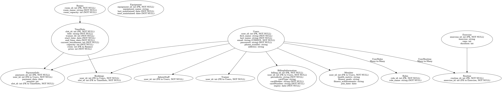
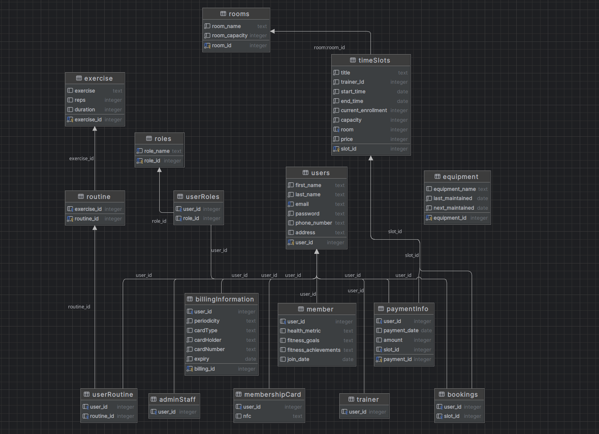

Vincent Gagnon 101052796, Yufeng Liu 101258905
# Pulse Performance (comp3005_merged)

Welcome to our comp 3005 final project called Pulse Performance! This project is structured to include two components as Git submodules: the frontend (React) and backend (drizzle). This setup allows for modular development and deployment of the application. 

# Getting Started

To begin using this repository and its submodules, follow these steps:

###  Prerequisites
- git

### Clone the Repository
```bash
git clone --recurse-submodules git@github.com:paranoidAndroid0124/comp3005_merged.git
```
Note: the "--recurse-submodules" flag ensures that the frontend and backend are initialized and cloned with the main repository.

#### Update submodule only
```bash
git submodule update --remote
```

# Running the Project

Open a terminal inside the cloned git repository

### Backend
navigate to the backend submodules directory
```bash
cd backend
```

Follow the backend's README instructions for setting up and running the backend server

### Frontend
Navigate to the frontend submodules directory
```bash
cd frontend
```

Follow the frontend's README instruction for setting up and running the frontend application

# Demo

The following accounts were created for testing with the following roles:
- admin => email: "admin@admin.com" password: "password"
- trainer => email: "john@doe.com" password: "password"
- member => email: "max@gagne.com" password: "password"

# Report

### Conceptual Design

The database schema was designed with high flexibility in mind, incorporating a "role" and "userRole" table to facilitate the addition of various roles and properties. This setup allows for the customization of each role by adding role-specific attributes, ensuring that the schema can be tailored to meet the client's requirements upon deployment.

<!-- TODO: add more ? -->

### Reduction to Relation Schemas

There is no single accepted technique for converting an Entity-Relation (ER) model into a relational schema such as postgres. However, the following steps were used:

1. Convert Entities into tables
- Entity conversion: Ech entity in the ER model were converted into a table. The attributes were added as columns of the table, and the primary key of the entity were added as primary key to the table.

2. Convert Relationships to tables
- One-to-one Relationships (1:1): The primary key of one entity as added a foreign key in the other entity's table. However, if the attributes were only associated with itself it was added as a seperate table.
- One-to-Many Relationships (1:N): The primary key of the "one" entity was used a foreign key in many table.
- Many-to-Many (M:N): A new table was created to represent the Relationship. The table included the primary key of the entities involved as a foreign key. 

3. Convert Attributes
- Key Attributes: key attributes were directly added as primary keys.
- Multi-valued Attributes: Multi-valued attributes were added as seperate tables. A foreign key linking back to the original entity and new column(s) for any additonal attributes were added.
- Derived Attributes: Derived attributes were not added and computed at runtime.


Figure 1: ER model for Pulse Performance


Figure 2: Schema diagram for Pulse Performance


### DDL File

The DDL file can be found in the "SQL" folder of this repository.

### DML File

The DML file can be found in the "SQL" folder of this repository.

### Implementation

This web application employs a modern and efficient technology stack designed to be scalable and maintainable. The backend is powered by PostgreSQL as the database system with Drizzle ORM facilitating the interaction between the Typescript application. For the frontend, React was used in conjuction with JavaScript to create a dynamic and responsive user interface.

#### Backend technologies

1. PostgreSQL: An advance, open-source relational database.
2. Drizzle ORM: A lightweight, Typescript first ORM (Object-Relational Mapping) tool that simplifies the interaction between the TypeScipt application and Postgres database. Drizzle allows the defination of model and queries directly in Typescipt. Providing type safety and reduced risk of SQL injection while also facilitating data manipulation and retrieval with TypeScipt feature such as async callbacks.
3. TypeScipt: A subset of JavaScript that adds static types allowing for more robust and maintainable code. TypeScipt is compiled to plain Javascript, make it compatible with any browser, host and OS.

#### Frontend technologies

1. React: A popular JavaScript library for building user interfaces which enables the reuse of UI components.
2. JavaScript: JavaScript is a scripting language used to create dynamic and interactive web content.

### Bonus Features

#### Nice to have

- Graphical calendar allowing for ease of use of the scheduling system

#### Industry Standards and Modern Development Practices

- Seperated project for the frontend and backend allowing for independent deploy of the each component.

- CORS was implemented to allow the frontend and backend to talk correctly.

- TypeScript: Typescript is commonly used in the industry to ensure type safety.

- React: React is a commonly used front end framework. It allows to dynamic and interactive web apps.

#### Security

- JWT Tokens for Endpoint protect: JWT (JSON Web Tokens) are issued at login and stored in the browser's local storage. The token is then passed in the header of the request to verify the identify of the user. JWT tokens allow for the the safe transmission of information between client and server.

- Drizzle minizes risk of SQL injection attached by providing a secure layer for database operation.

### GitHub repository

This repository and its submodules have been made public. Each include their own README explaining how to install and start the program.
